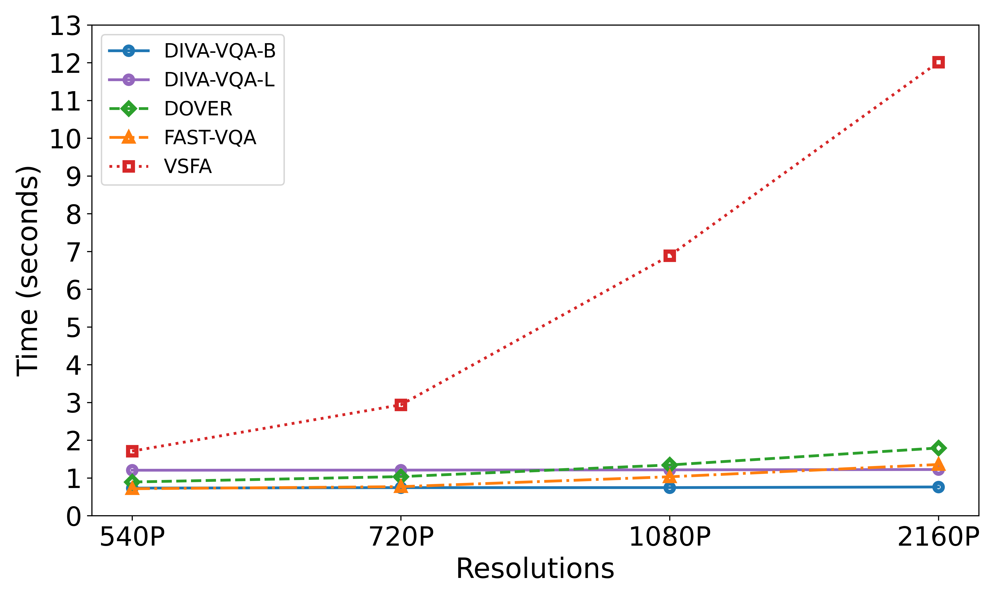

# DIVA-VQA
 
[](https://github.com/xinyiW915/DIVA-VQA)


[//]: # (put arxiv)
[//]: # ([![arXiv]&#40;https://img.shields.io/badge/arXiv-2407.11496-b31b1b.svg&#41;]&#40;https://arxiv.org/abs/2407.11496&#41;)

Official Code for the following paper:

**X. Wang, A. Katsenou, and D. Bull**. [DIVA-VQA: Detecting Inter-Frame Variations in UGC Video Quality](https://arxiv.org/abs/)

Try our online demo on Hugging Face 🤗: [https://huggingface.co/spaces/xinyiW915/DIVA-VQA](https://huggingface.co/spaces/xinyiW915/DIVA-VQA)

The paper “[DIVA-VQA: Detecting Inter-Frame Variations in UGC Video Quality]()” was accepted by the IEEE International Conference on Image Processing. ([ICIP 2025](https://2025.ieeeicip.org/)).

---

## Performance

[//]: # (put badge)
[//]: # ([![PWC]&#40;https://img.shields.io/endpoint.svg?url=https://paperswithcode.com/badge/relax-vqa-residual-fragment-and-layer-stack/video-quality-assessment-on-live-vqc&#41;]&#40;https://paperswithcode.com/sota/video-quality-assessment-on-live-vqc?p=relax-vqa-residual-fragment-and-layer-stack&#41;)

We evaluate the performance of DIVA-VQA on five UGC datasets. Based on different pre-trained models and features, DIVA-VQA has two different versions of models:
- **DIVA-VQA-B**: Utilizes the SlowFast R50-3D and Swin-Base pre-trained models with a patch size of 16. The feature dimension is 9984. 
- **DIVA-VQA-L**: Utilizes the SlowFast R50-3D and Swin-Large pre-trained models with a patch size of 16. The feature dimension is 11520.

#### **Spearman’s Rank Correlation Coefficient (SRCC)**
| **Model**                   | **CVD2014** | **KoNViD-1k** | **LIVE-VQC** | **YouTube-UGC** |
|----------------------------|-------------|----------------|---------------|------------------|
| DIVA-VQA-B (w/ fine-tune)  | 0.900       | 0.892          | **0.895**         | 0.858            |
| **DIVA-VQA-L (w/ fine-tune)** | **0.911**   | **0.905**      | **0.895**     | **0.881**        |

#### **Pearson’s Linear Correlation Coefficient (PLCC)**  
| **Model**                   | **CVD2014** | **KoNViD-1k** | **LIVE-VQC** | **YouTube-UGC** |
|----------------------------|-------------|----------------|---------------|------------------|
| DIVA-VQA-B (w/ fine-tune)  | 0.922       | 0.900          | **0.924**         | 0.873            |
| **DIVA-VQA-L (w/ fine-tune)** | **0.917**   | **0.907**      | **0.924**     | **0.877**        |

#### **Performance Comparison When Trained on LSVQ**
| **Model**                   | **SRCC (LSVQ_test)** | **PLCC (LSVQ_test)** | **SRCC (LSVQ_1080p)** | **PLCC (LSVQ_1080p)** |
|----------------------------|-----------------------|------------------------|-------------------------|-----------------------|
| DIVA-VQA-B  | 0.877                 | 0.877                  | 0.789                   | **0.832**                 |
| **DIVA-VQA-L** | **0.881**             | **0.881**              | **0.790**               | 0.830              |

More results and ablation studies can be found in **[correlation_result.ipynb](https://github.com/xinyiW915/DIVA-VQA/blob/main/src/correlation_result.ipynb)**.

## Proposed Model
Overview of the proposed framework with two core modules: Patch Difference Fragmentation and Spatio-Temporal Feature Extraction.


The comparison of running time (on GPU, averaged over ten runs) across different spatial resolutions:



## Usage
### 📌 Install Requirement
The repository is built with **Python 3.10** and can be installed via the following commands:

```shell
git clone https://github.com/xinyiW915/DIVA-VQA.git
cd DIVA-VQA
conda create -n divavqa python=3.10 -y
conda activate divavqa
pip install -r requirements.txt  
```


### 📥 Download UGC Datasets

The corresponding UGC video datasets can be downloaded from the following sources:  
[LSVQ](https://github.com/baidut/PatchVQ), [KoNViD-1k](https://database.mmsp-kn.de/konvid-1k-database.html), [LIVE-VQC](https://live.ece.utexas.edu/research/LIVEVQC/), [YouTube-UGC](https://media.withyoutube.com/), [CVD2014](https://qualinet.github.io/databases/video/cvd2014_video_database/).  

The metadata for the experimented UGC dataset is available under [`./metadata`](./metadata).  

Once downloaded, place the datasets in any other storage location of your choice. Ensure that the `videos_dir` in the [`load_dataset`](./src/main_diva-vqa.py) function inside `main_diva-vqa.py` is updated accordingly.


### 🎬 Test Demo  
Run the pre-trained models to evaluate the quality of a single video.  

The model weights provided in [`./log/reported_results/best_model`](./log/reported_results/best_model/) for the fine-tuned version and [`./log/best_model`](./log/best_model/) for the non-fine-tuned version, contain the best-performing saved weights from training.
To evaluate the quality of a specific video, run the following command:
```shell
python test_demo.py 
    -device <DEVICE> 
    -is_finetune <True/False> 
    -save_path <MODEL_PATH> 
    -train_data_name <TRAIN_DATA_NAME> 
    -test_data_name <TEST_DATA_NAME>
    -test_video_path <DEMO_TEST_VIDEO> 
    -network_name <diva-vqa/diva-vqa_large>
```
Or simply try our demo video by running:
```shell
python test_demo.py 
```
Simply calculate the complexity of our demo video by running:
```shell
python test_demo_time_flops.py
```

## Training  
Steps to train DIVA-VQA from scratch on different datasets.  

### Extract Features  
Run the following command to extract features from videos:   
```shell
python main_diva-vqa.py -database lsvq_train -feat_name diva-vqa_large -feature_save_path ../features/diva-vqa/
```


### Train Model  
Train our model using extracted features:
```shell
python model_regression_simple.py -data_name youtube_ugc -network_name diva-vqa_large -feature_path ../features/ -save_path ../model/
```


For **LSVQ**, train the model using:  
```shell
python model_regression.py -data_name lsvq_train -network_name diva-vqa_large -feature_path ../features/ -save_path ../model/
```


### Fine-Tuning
To fine-tune the pre-trained model on a new dataset, modify [`train_data_name`](./src/model_fine_tune.py) to match the dataset used for training, and [`test_data_name`](./src/model_fine_tune.py) to specify the dataset for fine-tuning.
Also, modify [`network_name`](./src/model_fine_tune.py) for different versions of DIVA-VQA and set the correct [`feature_path`](./src/model_fine_tune.py).
```shell
python model_finetune.py
```


## Acknowledgment
This work was funded by the UKRI MyWorld Strength in Places Programme (SIPF00006/1) as part of my PhD study.

## Citation
If you find this paper and the repo useful, please cite our paper 😊:

```bibtex
@article{wang2024relax,
      title={ReLaX-VQA: Residual Fragment and Layer Stack Extraction for Enhancing Video Quality Assessment},
      author={Wang, Xinyi and Katsenou, Angeliki and Bull, David},
      year={2024},
      eprint={2407.11496},
      archivePrefix={arXiv},
      primaryClass={eess.IV},
      url={https://arxiv.org/abs/2407.11496}, 
}
@article{wang2025diva,
      title={DIVA-VQA: Detecting Inter-Frame Variations in UGC Video Quality},
      author={Wang, Xinyi and Katsenou, Angeliki and Bull, David},
      year={2025},
}
```

## Contact:
Xinyi WANG, ```xinyi.wang@bristol.ac.uk```
